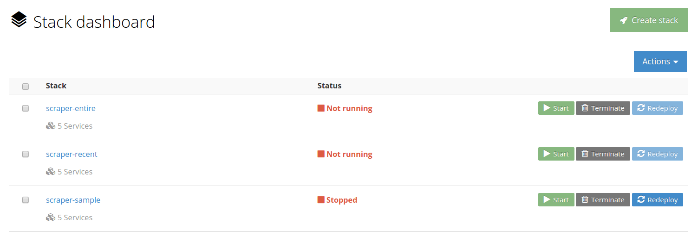

# opentrials-scraper

OpenTrials scraper for all trial registers.

## Registers

### NCT

- Website: https://clinicaltrials.gov/
- Readme: https://github.com/opentrials/scraper/tree/master/docs/nct.md
- Status: development

### ISRCTN

- Website: http://www.isrctn.com/
- Readme: https://github.com/opentrials/scraper/tree/master/docs/isrctn.md
- Status: development

### EUCTR

- Website: https://www.clinicaltrialsregister.eu/
- Readme: https://github.com/opentrials/scraper/tree/master/docs/euctr.md
- Status: development

### ACTRN

- Website: http://anzctr.org.au/
- Readme: https://github.com/opentrials/scraper/tree/master/docs/actrn.md
- Status: planned

### JPRN

- Website: http://www.umin.ac.jp/ctr/
- Readme: https://github.com/opentrials/scraper/tree/master/docs/jprn.md
- Status: planned

## Design Overview

Terminology:
- scraper - Scrapy project (the core python package).
- spider - object with rules and extractors to scrape concrete register
- item - dictionary based on data model with scraped data for register
- pipeline - item processor (like store item in database)
- utils - collection of utils for register
- stack - collection of scrapy process containers to run on Tutum
- warehouse - database to store collected data

### Scraper

Scraper is a valid `Scrapy` project so it uses all well-known
design patterns and follows the framework architecture.

To scrape a register it need:
- spider
- item (data model)
- utils (optionally)

While scraping `pipelines.Database` will store item data to the warehouse.

### Stacks

Stacks provide different scraping strategies and tasks.
For example to implement initial scraping and then only
update warehouse to stay up to date could be used:
- entire stack (processes like `scrapy crawl <register> -a date_from=2001-01-01`)
- recent stack (processes like `scrapy crawl <register>` - last 2 days be default)

### Warehouse

Warehouse is a database to store scraped data:
- table per register
- fields are typed when possible

### Deployment

Deployment process:
- CI/CD server builds Docker image from scraper package and push
it to opentrials account on Docker hub.
- CI/CD server updates stacks on Tutum.

### Management

To start/stop an actual scraping Tutum dashboard is used:

### Contributing

Please read the contribution guideline:

[How to Contribute](CONTRIBUTING.md)

Thanks!
